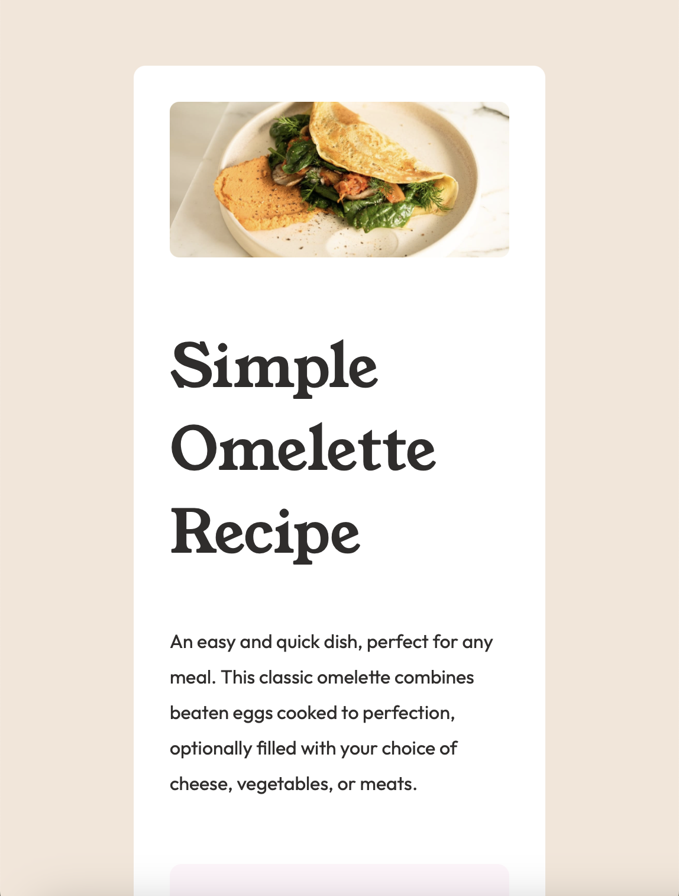

# Frontend Mentor - Recipe page solution

This is a solution to the [Recipe page challenge on Frontend Mentor](https://www.frontendmentor.io/challenges/recipe-page-KiTsR8QQKm). Frontend Mentor challenges help you improve your coding skills by building realistic projects. 

## Table of contents

- [Overview](#overview)
  - [The challenge](#the-challenge)
  - [Screenshot](#screenshot)
  - [Links](#links)
- [My process](#my-process)
  - [Built with](#built-with)
  - [What I learned](#what-i-learned)
  - [Continued development](#continued-development)
  - [Useful resources](#useful-resources)
- [Author](#author)
- [Acknowledgments](#acknowledgments)

## Overview

### Screenshot



### Links

- Live Site URL: [https://camryntidsworth.github.io/recipe-page/](https://camryntidsworth.github.io/recipe-page/)

## My process

### Built with

- Semantic HTML5 markup
- CSS custom properties
- Flexbox

### What I learned

I practiced writing media queries and writing responsive code with this project. This was the first time I've written a media query without a tutorial. See code snippet below, constructive feedback is always welcome!

```css
@media only screen and (max-width: 375px) {
   main {
        width: 100%;
        background-color: var(--white);
    }
    body {
        background-color: var(--white);
    }
    .text-container {
        padding-inline: 2.5rem;
    } 
}

@media only screen and (min-width: 375.5px) {
    main {
        width: 50%;
        background-color: var(--white);
        border-radius: 10px;
        margin: 10%;
        padding-inline: min(4vh, 2rem);
        padding-block: min(4vh, 2rem);
    }
    img {
        border-radius: 8px;
    }
}
```

### Continued development

I plan to continue focusing on responsive design. Especially focusing on using CSS well to minimize the use of unnecessary media queries, and understanding which units to use where for responsive design (you can see in this project my units are kind of all over the place).

### Useful resources

- [A practical guide to responsive web design](https://www.youtube.com/watch?v=x4u1yp3Msao&list=LL&index=2) - A good intro to leveraging CSS for responsive design.
- [Creating squishy padding and margin that adapt to the viewport](https://www.youtube.com/watch?v=7khSaA91e04&list=LL&index=1) - A good way to make flexible margins that don't get awkward at different screen sizes.

## Author

- Frontend Mentor - [@CamrynTidsworth](https://www.frontendmentor.io/profile/CamrynTidsworth)

## Acknowledgments

Thank you to [@LaurenAMolloy](https://www.frontendmentor.io/profile/LaurenAMolloy) for introducing me to Kevin Powell's resources for responsive design. They were very helpful!
